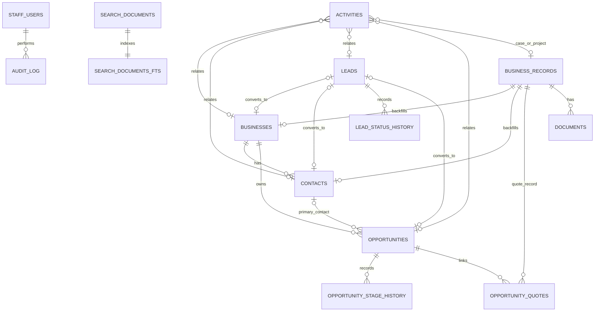

# HIDACA CRM expansion

## Existing system and compatibility decisions

The application remains a vinext/React application deployed through OpenAI
Sites. ChatGPT supplies identity; D1 `staff_users` remains the server-side
allowlist; D1 stores structured records and R2 stores private documents.
Existing `business_records`, `documents`, `audit_log`, routes, module keys,
roles, visual tokens, and deployment bindings are preserved.

Only user-facing CRM terminology changed:

- Clientes → Businesses
- Nombre del cliente → Business Name
- Contacto → Contacts
- Órdenes de cambio → Cases

The legacy module keys (`clientes`, `contactos`, `ordenes-cambio`) and
`customer_name` column remain unchanged. Renaming them would break existing
records, URLs, API consumers, and quote/document relationships without adding
user value. New normalized CRM tables use current terminology.

## User experience

The sidebar now groups CRM, Operations, Agenda, and access modules. Search is
centered in the sticky header and supports mouse, keyboard, `Ctrl+K`,
`Command+K`, arrows, Enter, and Escape. Results are grouped by entity and
deep-link to records.

Leads and Opportunities provide list, filter, sort, form, detail, related
activity, history, pipeline, success, error, and authorized reopen states.
Schedule is an agenda/list presentation; Calendar offers month, week, and day
views over the same Activities rows.

Pipeline animation is decorative. Stage names, `aria-current`, status text,
and controls carry the meaning, and animation is disabled when the operating
system requests reduced motion.

## Entity relationships

Activities use a validated polymorphic `related_type` / `related_id` pair so
one row can appear in both Schedule and Calendar while linking to a Business,
Contact, Lead, Opportunity, Case, or Project.

## Transition rules

### Leads

| From | Normal action | To | Notes |
| --- | --- | --- | --- |
| New | Advance Stage | Contacted | Persists history |
| Contacted | Advance Stage | Working | Persists history |
| Working | Mark Unqualified | Unqualified | Terminal |
| Working | Convert Lead | Converted | Transactional workflow |
| Unqualified | Admin reopen with reason | Working | Audited |
| Converted | Admin reopen with reason | Working | Original conversion links/history remain |

Direct skips, backward normal transitions, and advancement from terminal
states are rejected.

### Opportunities

| From | Normal action | To | Notes |
| --- | --- | --- | --- |
| Evaluation | Advance Stage | Quote | Quote link is optional |
| Quote | Advance Stage | Negotiation / Review | Linked Quotes remain |
| Negotiation / Review | Close | Closed | Won/Lost required |
| Closed | Admin reopen with reason | Negotiation / Review | Prior outcome remains in history |

### Closing outcomes

| Stage | Outcome | Required data | Result |
| --- | --- | --- | --- |
| Closed | Won | Closed date and actor | Normal progression disabled |
| Closed | Lost | Closed date, actor, loss reason | Normal progression disabled |

`Closed` is always the stage. `Won` and `Lost` are mutually exclusive outcomes.

## Lead conversion

Conversion is available only from Working and requires:

- Business Name
- Contact Name
- at least one of email or phone
- Opportunity Title

The review modal prepopulates lead data and retrieves possible duplicate
Businesses by normalized name and Contacts by normalized email or phone. The
operator must select a matching existing row or confirm new rows. A selected
Contact cannot belong to a different Business; an unassigned selected Contact
is linked during conversion.

One D1 `batch()` creates or links the Business and Contact, creates the
Opportunity, updates the Lead, writes both histories, updates search, and
writes the audit entry. D1 batch failure rolls back the complete conversion.
Converted fields and the unique Opportunity-to-Lead index prevent a second
conversion. The UI navigates to the Opportunity and retains links to all
created records.

## Search architecture

`search_documents` contains only business-facing records. FTS5 indexes title,
subtitle, and searchable identifiers/text through insert/update/delete
triggers. All input is converted to a quoted prefix query, capped at eight
tokens. Results are capped at 60 rows and grouped after a ranked query.

Every search request passes the same ChatGPT identity and D1 allowlist check as
the rest of the application. The existing authorization model grants all
active staff access to business records; it has no row-level territories.
Authentication records, audit rows, secrets, object keys, logs, and internal
tables are never indexed or returned.

Search documents are updated when Businesses, Contacts, Leads, Opportunities,
Activities, legacy records, and Documents change. New result types use stable
entity identifiers and deep links.

## Permissions and security

| Capability | Viewer | Operator | Admin |
| --- | --- | --- | --- |
| Read/search CRM and agenda | Yes | Yes | Yes |
| Create/edit/advance/close | No | Yes | Yes |
| Archive records | No | Yes | Yes |
| Reopen terminal Lead/Opportunity | No | No | Yes |
| Manage staff allowlist | No | No | Yes |

APIs enforce these rules server-side. UI visibility is convenience only.
Queries use prepared statements. Search is bounded and excludes system data.
Document access remains authenticated and R2 objects are unchanged.

## Migration and retention

Migration `0001_big_celestials.sql` is additive:

1. Create CRM, history, activity, quote-link, and search tables.
2. Add lookup, status, relationship, and date indexes.
3. Create FTS5 and synchronization triggers.
4. Backfill active legacy Clientes into Businesses.
5. Backfill active legacy Contactos into Contacts.
6. Index active legacy records and Documents.

Legacy tables and rows remain the system of record for pre-existing
non-normalized Operations modules. New CRM tables are authoritative for the
new CRM screens. R2 is not modified by this migration.

## Test coverage

- Complete Lead and Opportunity transition matrices.
- Terminal-state and invalid-transition rejection.
- Conversion required fields and normalization.
- Additive migration, legacy-row retention, backfill, FTS, and indexes.
- Simulated transaction rollback on a forced relationship failure.
- Authorization presence on every new API and admin-only reopen routes.
- Duplicate-aware, idempotent, audited conversion source checks.
- Closed stage/outcome/loss-reason checks.
- Shared Activities source for Schedule and Calendar.
- Search authorization, limits, prepared FTS query, keyboard UI, and deep links.
- Existing authentication, document, D1, R2, and module regression coverage.

## Definition of done

- All new navigation sections and responsive states render without overflow.
- Search returns bounded grouped results and excludes unauthorized/system data.
- All records persist through D1 and every state transition records history.
- Conversion is atomic, duplicate-aware, idempotent, and navigates to its
  Opportunity.
- Opportunity closure requires Won or Lost; Lost requires a reason.
- Schedule and Calendar show the same Activities.
- Viewer, Operator, and Admin behaviors match the permission matrix.
- Legacy records, routes, module keys, documents, and hosting workflow remain.
- Lint, TypeScript, automated tests, build, desktop/mobile browser checks, and
  production smoke tests pass.
