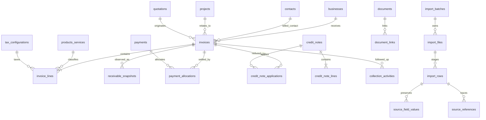

# Modelo de datos normalizado para facturación HIDACA

## Propósito y límites

Este diseño convierte los hallazgos del corpus de facturación en un contrato de implementación para D1/Drizzle. No modifica el esquema actual. Los nombres públicos permanecen en español y los identificadores de base de datos/TypeScript permanecen en inglés.

Principios bloqueados:

- El documento emitido controla sus propios datos; la matriz es un índice operativo.
- Los valores originales y normalizados se conservan por separado.
- Un número de factura no identifica por sí solo una factura.
- Una factura anulada y su sustituta son registros relacionados, no duplicados.
- `Avance` y `Pendiente` de la matriz son instantáneas agregadas; no crean pagos.
- Los registros heredados de `business_records` se conservan durante la migración.
- Los documentos aceptados se retienen de forma privada en R2 y la evidencia cruda es append-only.

## Diagrama lógico

## Entidades propuestas

### `invoices`

Registro canónico de una factura emitida.

| Campo | Tipo / nulabilidad | Regla |
|---|---|---|
| `id` | `text` PK | UUID. |
| `legacy_record_id` | `text` nullable FK → `business_records.id` | Único cuando exista; no elimina el registro heredado. |
| `business_id` | `text` not null FK → `businesses.id` | `restrict` al eliminar. |
| `contact_id` | `text` nullable FK → `contacts.id` | `set null`. |
| `project_id` | `text` nullable FK → `projects.id` | `set null`. |
| `quotation_id` | `text` nullable FK → `quotations.id` | `set null`. |
| `source_document_id` | `text` nullable FK → `documents.id` | Documento emitido de mayor autoridad; `set null`. |
| `invoice_number_raw` | `text` not null | Valor exacto, por ejemplo `F0045`. |
| `invoice_number_normalized` | `text` not null | Mayúsculas, espacios/puntuación normalizados; nunca reemplaza el valor crudo. |
| `issue_date` | `text` nullable | ISO `YYYY-MM-DD`; nulo si no es válido. |
| `issue_date_raw` | `text` not null default `''` | Texto exacto de la fuente. |
| `issue_year` | `integer` nullable | Derivado de `issue_date`; no derivar de una fecha inválida. |
| `due_date` | `text` nullable | ISO; nulo si no es válido. |
| `due_date_raw` | `text` not null default `''` | Texto exacto. |
| `ncf_raw` | `text` not null default `''` | NCF/e-NCF exacto. |
| `ncf_normalized` | `text` not null default `''` | Solo caracteres válidos normalizados. |
| `ncf_type` | `text` not null default `''` | Tipo observado/validado, sin inferir cuando falte. |
| `document_version` | `integer` not null default `1` | Incrementa para versiones reales del mismo documento. |
| `status` | enum text not null | `draft`, `issued`, `partial`, `paid`, `overdue`, `cancelled`, `replaced`, `credited`, `unknown`. |
| `replaced_invoice_id` | `text` nullable self-FK | La sustituta apunta a la factura anulada; `set null`. |
| `cancellation_reason` | `text` not null default `''` | Evidencia o resolución manual. |
| `currency` | `text` not null default `DOP` | ISO 4217. |
| `payment_terms_raw` | `text` not null default `''` | Condición original. |
| `purchase_order_number` | `text` not null default `''` | Orden de compra original. |
| `sales_representative` | `text` not null default `''` | Valor histórico del documento. |
| `subtotal_amount` | `real` nullable | No recalcular si la fuente no lo permite. |
| `discount_amount` | `real` nullable | Nulo ≠ cero. |
| `taxable_amount` | `real` nullable | Base gravada declarada/derivada con trazabilidad. |
| `exempt_amount` | `real` nullable | Base exenta. |
| `tax_amount` | `real` nullable | ITBIS u otro impuesto declarado. |
| `total_amount` | `real` nullable | Total emitido. |
| `paid_amount_snapshot` | `real` nullable | Copia de `Avance` cuando la autoridad es la matriz. |
| `balance_amount_snapshot` | `real` nullable | Copia de `Pendiente`. |
| `snapshot_as_of` | `text` nullable | Fecha/hora del lote que observó el saldo. |
| `source_authority` | enum text not null | `issued_document`, `matrix`, `manual_resolution`. |
| `source_values` | `text` JSON not null | Valores crudos resumidos; la evidencia completa vive en staging. |
| `created_by`, `created_at`, `updated_at` | text not null | Auditoría. |
| `archived_at` | text nullable | Archivo lógico; las facturas emitidas no se borran en cascada. |

Índices:

- Único parcial en `ncf_normalized` cuando no está vacío.
- Único compuesto en `(business_id, issue_year, invoice_number_normalized, ncf_normalized, document_version)`.
- Índices en `(business_id, issue_date)`, `status`, `due_date`, `project_id`, `quotation_id`, `source_document_id`, `replaced_invoice_id` y `legacy_record_id`.
- Un candidato sin NCF requiere revisión; no debe relajarse el índice hasta colapsar versiones/anulaciones.

### `invoice_lines`

| Campo | Tipo / nulabilidad | Regla |
|---|---|---|
| `id` | `text` PK | UUID. |
| `invoice_id` | `text` not null FK → `invoices.id` | `cascade`; las líneas pertenecen al documento. |
| `line_number` | `integer` not null | Orden estable desde la fuente. |
| `product_service_id` | `text` nullable FK | `set null`. |
| `item_code`, `description`, `location` | `text` not null default `''` | Valores exactos. |
| `quantity`, `width_cm`, `height_cm`, `area_sqm` | `real` nullable | Nulo cuando falta/no aplica. |
| `unit_of_measure` | `text` not null default `''` | No inferir unidades ausentes. |
| `unit_price`, `line_subtotal`, `discount_amount`, `tax_amount`, `line_total` | `real` nullable | Separar declarado y calculado en `source_values`/issues. |
| `tax_configuration_id` | `text` nullable FK | Tratamiento aplicado a la línea. |
| `source_sheet`, `source_range`, `source_formula` | `text` not null default `''` | Proveniencia. |
| `source_values`, `value_states` | JSON text not null | Distingue vacío, cero, no aplica y no calculado. |

Restricciones: único `(invoice_id, line_number)`; índices en `invoice_id`, `product_service_id` y `tax_configuration_id`.

### `payments` (extensión de la tabla existente)

La tabla actual ya modela transacciones y debe conservarse. Agregar:

- `transaction_reference`, `receipt_number`, `payer_name`, `bank_name`, `account_last4`.
- `evidence_status`: `documented`, `matrix_only`, `manual`, `unverified`.
- `voided_at`, `void_reason`.
- Índice único parcial `(business_id, transaction_reference, payment_date, amount)` cuando la referencia no está vacía.

No agregar `invoice_id` directo: un pago puede cubrir varias facturas y una factura puede recibir varios pagos.

### `payment_allocations`

| Campo | Tipo / nulabilidad | Regla |
|---|---|---|
| `id` | `text` PK | UUID. |
| `payment_id` | `text` not null FK → `payments.id` | `restrict`; una transacción aceptada no se elimina accidentalmente. |
| `invoice_id` | `text` not null FK → `invoices.id` | `restrict`. |
| `amount` | `real` not null | Mayor que cero salvo reversión explícita. |
| `currency` | `text` not null | Debe coincidir o existir conversión documentada. |
| `allocation_date` | `text` nullable | Fecha efectiva. |
| `source_document_id` | `text` nullable FK → `documents.id` | Evidencia de recibo/pago. |
| `status` | enum text | `draft`, `applied`, `reversed`. |
| `reversal_of_id` | `text` nullable self-FK | Reversión append-only. |
| `import_batch_id` | `text` nullable FK | Propiedad del lote para reversión. |
| `created_by`, `created_at` | text not null | Auditoría. |

Único `(payment_id, invoice_id, amount, allocation_date, import_batch_id)` para reintentos idempotentes. La suma aplicada no puede exceder el pago ni el saldo sin issue/revisión.

### `credit_notes`

Campos principales: `id`, `business_id`, `source_document_id`, `credit_note_number_raw/normalized`, `ncf_raw/normalized`, `issue_date/raw`, `currency`, `reason`, `subtotal_amount`, `tax_amount`, `total_amount`, `status` (`issued`, `applied`, `void`, `unknown`), `source_authority`, `source_values`, auditoría y `archived_at`.

Índices únicos parciales por NCF y por `(business_id, issue_year, credit_note_number_normalized, ncf_normalized)`.

### `credit_note_lines`

Misma forma financiera que `invoice_lines`, con `credit_note_id` not null y único `(credit_note_id, line_number)`.

### `credit_note_applications`

Une una nota de crédito con una o más facturas: `id`, `credit_note_id`, `invoice_id`, `amount`, `application_date`, `status`, `reversal_of_id`, `source_document_id`, `import_batch_id` y auditoría. No confundir la emisión de la nota con su aplicación.

### `receivable_snapshots`

Instantáneas históricas, no transacciones:

- `id`, `invoice_id`, `as_of`, `source_document_id`, `import_batch_id`.
- `invoice_total`, `paid_amount`, `balance_amount`, `status_raw`, `status_normalized`.
- `source_sheet`, `source_row_number`, `raw_values`, `created_at`.

Único `(invoice_id, as_of, source_document_id, source_row_number)`. Una nueva importación agrega o deduplica la misma evidencia; no sobrescribe historia.

### `collection_activities`

Seguimiento de cobro: `id`, `invoice_id`, `business_id`, `contact_id`, `activity_type` (`call`, `email`, `visit`, `promise_to_pay`, `dispute`, `note`, `other`), `occurred_at`, `next_action_at`, `owner_email`, `outcome`, `promised_amount`, `promised_date`, `notes`, `source_document_id`, auditoría y `archived_at`.

Índices en `(invoice_id, occurred_at)`, `(owner_email, next_action_at)` y `activity_type`.

### `products_services`

Catálogo opcional sin reescribir descripciones históricas: `id`, `code`, `name`, `normalized_name`, `kind` (`product`, `service`, `labor`, `fee`, `other`), `default_unit`, `default_tax_configuration_id`, `active`, auditoría. El texto de la factura sigue en `invoice_lines.description`.

### `tax_configurations`

Configuración con vigencia: `id`, `code`, `label`, `tax_kind`, `rate`, `effective_from`, `effective_to`, `applies_to` (`line`, `invoice`, `fee`), `calculation_basis`, `active`, `source`, auditoría.

No debe asumirse 18 %. El importador registra el tratamiento declarado y crea un issue si no puede explicarlo con una configuración vigente.

## Reutilización del modelo existente

| Estructura actual | Decisión |
|---|---|
| `businesses`, `contacts`, `projects`, `quotations` | Reutilizar; enlazar solo por identificadores exactos únicos o decisión humana. |
| `payments` | Reutilizar y extender; no crear pagos desde `Avance`. |
| `documents`, `document_links` | Reutilizar para PDF/XLSX, recibos, notas de crédito y anexos. |
| `import_batches`, `import_files`, `import_batch_sources`, `import_rows` | Reutilizar y agregar tipo de lote/documento. |
| `source_field_values`, `import_issues`, `import_candidates`, `source_references` | Reutilizar; ampliar enums/candidate types para factura, pago y nota de crédito. |
| `entity_history`, `audit_log` | Reutilizar; todas las correcciones y reversiones generan eventos. |
| `business_records` | Mantener como capa heredada durante la transición. |

## Compatibilidad y backfill de `business_records`

1. Crear tablas nuevas sin retirar módulos `facturas`/`pagos`.
2. Añadir `legacy_record_id` único en `invoices` y conservar `business_records`.
3. Ejecutar dry-run de backfill. Un registro heredado solo se enlaza automáticamente si:
   - existe un `invoice_number`/NCF exacto único dentro de `metadata`; y
   - negocio/año no producen más de un candidato.
4. Los registros ambiguos van a `import_candidates`/`import_issues`; no se duplican ni se sobreescriben.
5. Durante convivencia, las vistas leen primero el registro normalizado y muestran una insignia “Heredado” cuando solo existe `business_records`.
6. Después de reconciliación, las escrituras nuevas usan tablas normalizadas; `business_records` queda read-only.
7. La retirada futura requiere aprobación separada y una exportación/rollback verificada.

## Ciclo de vida y borrado

- Facturas, notas, pagos, asignaciones y evidencia aceptada son archivables/reversibles, no eliminables desde UI normal.
- Staging de un lote no aceptado puede eliminarse con el lote por `cascade`.
- Al aceptar, el lote conserva ownership de registros creados y vínculos de evidencia.
- La reversión marca/revierte solo registros creados por ese lote; no borra entidades preexistentes ni correcciones manuales posteriores.
- Documentos aceptados permanecen privados en R2; `documents` y `source_references` mantienen hash, ruta y linaje.
- Cambios canónicos generan `entity_history`; acciones administrativas generan `audit_log`.

## Módulos de interfaz requeridos

### Facturas

- Lista: número, fecha, cliente, NCF, total, saldo, vencimiento, estado y autoridad.
- Filtros: periodo, cliente, estado, saldo, vencidas, NCF, proyecto, cotización, lote y “requiere revisión”.
- Detalle: encabezado, líneas, impuestos, pagos/asignaciones, notas de crédito, historial de saldo, cobranza, documentos, fuente y auditoría.
- Acciones según permiso: revisar vínculo, registrar pago documentado, aplicar crédito, anular/sustituir, exportar y archivar.

### Pagos y asignaciones

- Lista por fecha, cliente, referencia, monto, no asignado y estado.
- Detalle con evidencia, asignaciones/reversiones y auditoría.
- Ninguna asignación automática sin evidencia transaccional identificable.

### Notas de crédito

- Lista y detalle con NCF, motivo, total, aplicaciones y saldo disponible.

### Cuentas por cobrar

- Vista calculada desde facturas + asignaciones + créditos, con envejecimiento, saldos de matriz como evidencia comparativa y discrepancias visibles.

### Cobranza

- Cola por vencimiento/próxima acción, responsable, promesa de pago y disputa.

### Permisos

- `viewer`: lectura/exportación permitida, sin mutaciones.
- `operator`: revisión, vínculos y registros operativos; no reversión de lotes ni cambios de configuración fiscal.
- `admin`: aceptación/reversión de lotes, configuración fiscal, anulaciones y resolución de conflictos críticos.

## Contrato funcional por módulo

Esta matriz cubre propósito, registro primario, campos, relaciones, estados, búsqueda/filtros, presentación/formulario, validación, permisos e importación.

| Módulo | Propósito / registro primario | Requeridos / opcionales | Relaciones | Estados | Búsqueda, filtros y columnas | Detalle / formulario | Validación e importación | Permisos |
|---|---|---|---|---|---|---|---|---|
| Empresas | Cliente facturado / `businesses` | Req: nombre, tipo, owner; opc: RNC, contacto, dirección | contactos, proyectos, facturas, pagos | activo/archivado | nombre, RNC, correo, teléfono; tipo/owner | identidad, fiscal, contacto, proyectos, documentos | RNC exacto único puede autoenlazar; nombre solo candidato | viewer read; operator edit; admin merge/archive |
| Contactos | Persona relacionada / `contacts` | Req: nombre; opc: negocio, título, correo, teléfonos | empresa, factura, cobranza | activo/archivado | nombre, empresa, correo, teléfono | identidad, canales, actividad | correo/teléfono exacto no único requiere revisión | viewer read; operator edit |
| Proyectos | Contexto del trabajo / `projects` | Req: nombre/empresa; opc: código, dirección, descripción | empresa, cotizaciones, facturas | existentes del CRM | nombre, código, empresa, servicio | resumen, ubicaciones, documentos, facturas | fuzzy nunca autoenlaza | viewer read; operator edit |
| Oportunidades | Flujo comercial / `opportunities` | Según CRM actual | empresa, proyecto, cotizaciones | pipeline actual | etapa, owner, empresa, valor | pipeline, actividad, cotizaciones | no crear desde factura sin evidencia | política CRM actual |
| Cotizaciones | Propuesta origen / `quotations` + revisiones | número, empresa, año/revisión | proyecto, oportunidad, factura | actual | número, empresa, año, estado | revisiones, líneas, finanzas, documentos | vínculo exacto produce candidato; revisión humana | política CRM actual |
| Facturas | Documento fiscal emitido / `invoices` | Req: negocio, número/issue, moneda, estado; opc: contacto/proyecto/cotización/NCF | negocio, líneas, pagos, créditos, documentos | draft/issued/partial/paid/overdue/cancelled/replaced/credited/unknown | número, NCF, cliente, fecha, total, saldo, vencimiento, estado | cabecera, líneas, impuestos, pagos, créditos, saldo, cobranza, fuente, auditoría | identidad compuesta; documento > matriz; no asumir tasa | viewer read; operator review; admin cancel/replace |
| Líneas de factura | Detalle vendible/fiscal / `invoice_lines` | Req: factura, orden; descripción si tiene importe; opc: medidas/precios/impuestos | factura, producto, tax config | hereda factura | código, descripción, ubicación | tabla y editor de línea | cantidades/moneda; fórmula y crudo preservados | edit según estado/rol |
| Pagos | Transacción documentada / `payments` | Req: negocio, importe/moneda/evidencia para aceptación; opc: referencia/banco | negocio, asignaciones, documento | pending/received/cleared/void/unknown | fecha, cliente, referencia, importe, no asignado | evidencia, asignaciones, reversión, auditoría | no crear desde Avance; referencia exacta única | viewer read; operator create/apply; admin void |
| Asignaciones | Aplicación pago→factura / `payment_allocations` | pago, factura, importe, estado | pago, factura, evidencia, lote | draft/applied/reversed | pago, factura, fecha, importe | vínculo y reversión | suma ≤ pago y saldo salvo issue; idempotente | operator apply; admin reverse |
| Notas de crédito | Crédito fiscal emitido / `credit_notes` | negocio, número/NCF, fecha, moneda, estado | líneas, aplicaciones, documentos | issued/applied/void/unknown | número, NCF, cliente, fecha, saldo | cabecera, líneas, aplicaciones, fuente | emisión ≠ aplicación; NCF único parcial | viewer read; operator review/apply; admin void |
| Cuentas por cobrar | Saldo/aging calculado + snapshots | factura/fecha/total/pagado/saldo | factura, pagos, créditos | raw/normalizado | cliente, vencimiento, aging, saldo, discrepancia | timeline de saldos y conciliación | snapshot no es transacción; tolerancia explícita | viewer read; operator resolve issue |
| Cobranza | Seguimiento / `collection_activities` | factura, tipo, fecha, owner | factura, negocio, contacto | por tipo/outcome | vencidas, próxima acción, owner, promesa, disputa | timeline, promesa, notas, próxima acción | importe/fecha de promesa válidos | viewer read; operator create; admin archive |
| Productos y servicios | Clasificación reusable / `products_services` | nombre, tipo, activo | líneas, tax config | activo/inactivo | código, nombre, tipo | datos base, unidad, impuesto | no reescribe descripción histórica | viewer read; admin/operator según política |
| Configuración fiscal | Regla/tasa con vigencia / `tax_configurations` | código, tipo, rate, vigencia | líneas/productos | activo/inactivo | código, tasa, periodo, aplica a | regla, base, vigencia | rangos no ambiguos; cambios auditados | admin write; viewer/operator read |
| Documentos | Evidencia privada / `documents` | nombre, key, MIME, tamaño, hash | cualquier entidad vía `document_links` | parsing status | nombre, hash, tipo, parse status | preview/metadatos/linaje | MIME/tamaño/hash; R2 privado | viewer autorizado read; operator upload |
| Lotes de importación | Unidad de control / `import_batches` | nombre, source, hash/config, estado | archivos, filas, entidades creadas | pending/processing/review_required/completed/failed/cancelled/reversed | fecha, estado, tipo, contadores | manifiesto, issues, candidatos, reconciliación | dry-run determinista; aceptación atómica | viewer read; operator review/accept; admin reverse |
| Historial/Auditoría | Trazabilidad / `entity_history`, `audit_log` | entidad, acción, actor, fecha | todas las entidades/documentos | append-only | entidad, actor, fecha, lote | timeline/diff/motivo | nunca sobrescribir/borrar desde UI | viewer read según alcance; sistema/admin write |

## Rollback del esquema

Las migraciones deben ser aditivas. El rollback inmediato desactiva rutas/vistas nuevas y conserva tablas/datos. No se eliminan columnas ni `business_records`. Una reversión de lote usa `import_batch_id`, `entity_history` y estados de reversión; nunca `DELETE` global.
