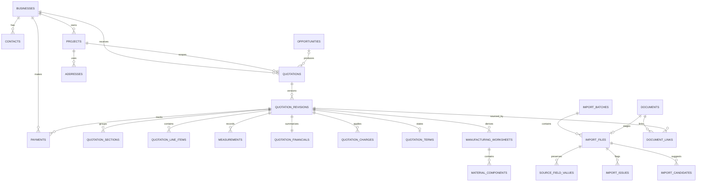

# Entity relationships

```mermaid
erDiagram
  BUSINESSES ||--o{ CONTACTS : has
  BUSINESSES ||--o{ PROJECTS : owns
  BUSINESSES ||--o{ QUOTATIONS : receives
  BUSINESSES ||--o{ PAYMENTS : makes
  PROJECTS ||--o{ ADDRESSES : uses
  PROJECTS ||--o{ QUOTATIONS : scopes
  OPPORTUNITIES o|--o{ QUOTATIONS : produces
  QUOTATIONS ||--o{ QUOTATION_REVISIONS : versions
  QUOTATION_REVISIONS ||--o{ QUOTATION_SECTIONS : groups
  QUOTATION_REVISIONS ||--o{ QUOTATION_LINE_ITEMS : contains
  QUOTATION_REVISIONS ||--o{ MEASUREMENTS : records
  QUOTATION_REVISIONS ||--|| QUOTATION_FINANCIALS : summarizes
  QUOTATION_REVISIONS ||--o{ QUOTATION_CHARGES : applies
  QUOTATION_REVISIONS ||--o| QUOTATION_TERMS : states
  QUOTATION_REVISIONS ||--o{ PAYMENTS : tracks
  QUOTATION_REVISIONS ||--o{ MANUFACTURING_WORKSHEETS : derives
  MANUFACTURING_WORKSHEETS ||--o{ MATERIAL_COMPONENTS : contains
  IMPORT_BATCHES ||--o{ IMPORT_FILES : contains
  DOCUMENTS ||--o| IMPORT_FILES : stages
  IMPORT_FILES ||--o{ SOURCE_FIELD_VALUES : preserves
  IMPORT_FILES ||--o{ IMPORT_ISSUES : flags
  IMPORT_FILES ||--o{ IMPORT_CANDIDATES : suggests
  DOCUMENTS ||--o{ DOCUMENT_LINKS : links
  QUOTATION_REVISIONS ||--o{ DOCUMENT_LINKS : sourced_by
```
